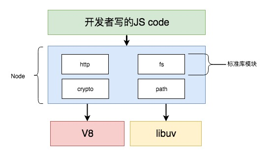
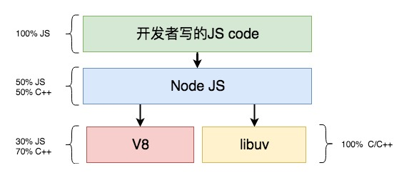
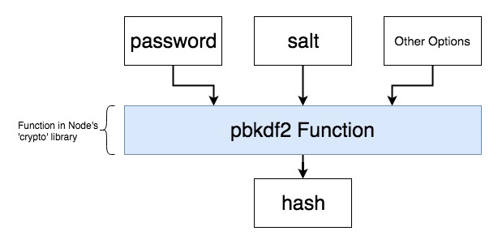
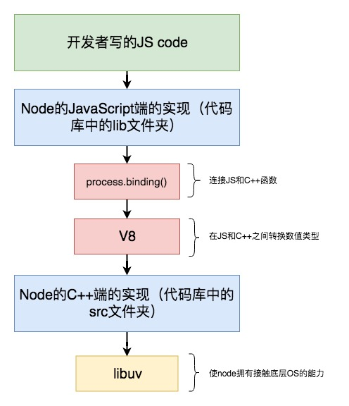
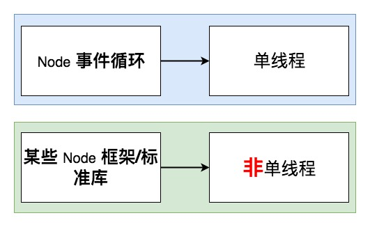

# Nodejs 源码学习

这个 Repo 是为了在研究 nodejs 源码的过程中，更好地理解其内部工作原理，我会写一些 demo 来帮助自己来巩固和验证自己的理解。

```sh
  yarn install
  yarn run node-test
```

## NodeJs 内部结构

我们在 js 文件然后在终端执行的 js 代码。通过两个模块帮助我们执行 js 代码：**V8**和**libuv**



- V8 [项目地址](https://github.com/v8/v8)

  V8 是 Google 用 C++和 JavaScript 开发的开源的 JavaScript 引擎,，用于在浏览器环境之外执行 JavaScript 代码。

- libuv [项目地址](https://github.com/libuv/libuv)

  libuv 是一个主要由 C/C++ 编写的开源工程，它可以让 node 直接调用系统底层的服务：包含文件系统，网络服务，还有一些并发操作。

拥有了 node，我们就可以不用写 C++代码和 V8，libuv 进行交互了。我们可以直接编写 js 代码，通过 Node 提供的 API 调用 V8 和 libuv 的代码就可以直接和使唤这两个大兄弟干活了～



下面我们找一个标准库的 PBKDF2 函数来研究下它的实现过程，主要分为 3 步：


### 在 node 的标准库(src 文件夹)中选一个函数

在[node_crypto.cc](https://github.com/nodejs/node/blob/d3d6cd3ecad19602a894bbe046253ae924d278d4/src/node_crypto.cc)文件中，是 node 的 crypto 模块在 c++中的实现。
在这个文件的大概最后的位置有这样一行代码：

```c++
  env->SetMethod(target, "pbkdf2", PBKDF2);
```

### 在 node 的源代码中(lib 文件夹)查找这个函数的实现

通过这行代码，node 把这个函数从 C++中暴露出来，然后通过 process.binding 让 js 端通过 pbkdf2 来进行调用。
在该文件的四千多行，我们可以看到 PBKDF2 代码的具体实现。

```c++
  inline void PBKDF2(const FunctionCallbackInfo<Value>& args) {
    auto rv = args.GetReturnValue();
    Environment* env = Environment::GetCurrent(args);
    CHECK(args[0]->IsArrayBufferView());  // keybuf; wrap object retains ref.
    CHECK(args[1]->IsArrayBufferView());  // pass
    CHECK(args[2]->IsArrayBufferView());  // salt
    CHECK(args[3]->IsUint32());  // iteration_count
    CHECK(args[4]->IsString());  // digest_name
    CHECK(args[5]->IsObject() || args[5]->IsUndefined());  // wrap object
    std::unique_ptr<PBKDF2Job> job(new PBKDF2Job(env));
    job->keybuf_data = reinterpret_cast<unsigned char*>(Buffer::Data(args[0]));
    job->keybuf_size = Buffer::Length(args[0]);
    CopyBuffer(args[1], &job->pass);
    CopyBuffer(args[2], &job->salt);
    job->iteration_count = args[3].As<Uint32>()->Value();
    Utf8Value digest_name(args.GetIsolate(), args[4]);
    job->digest = EVP_get_digestbyname(*digest_name);
    if (job->digest == nullptr) return rv.Set(-1);
    if (args[5]->IsObject()) return PBKDF2Job::Run(std::move(job), args[5]);
    env->PrintSyncTrace();
    job->DoThreadPoolWork();
    rv.Set(job->ToResult());
  }
```

### 在 V8 和 libuv 中查看这个函数是如何真正实现的

分析到这里，我们感觉到 node 的标准库中一些代码的最终实现是在 C++部分实现的。那 V8 和 libuv 在着过程中他们到底起到了什么作用呢？

我们首先看 V8 的作用，继续在这个文件的第五十几行：

```c++
  using v8::Array;
  using v8::Boolean;
  using v8::ConstructorBehavior;
  using v8::Context;
  using v8::DontDelete;
  using v8::EscapableHandleScope;
  using v8::Exception;
  using v8::External;
  using v8::FunctionCallbackInfo;
  using v8::FunctionTemplate;
  using v8::HandleScope;
  using v8::Int32;
  using v8::Integer;
  using v8::Isolate;
  using v8::Just;
  using v8::Local;
  using v8::Maybe;
  using v8::MaybeLocal;
  using v8::NewStringType;
  using v8::Nothing;
  using v8::Null;
  using v8::Object;
  using v8::PropertyAttribute;
  using v8::ReadOnly;
  using v8::SideEffectType;
  using v8::Signature;
  using v8::String;
  using v8::Uint32;
  using v8::Undefined;
  using v8::Value;
```

在这一段代码中，我们看到 Object,Array,Boolean,String 等等一些 JavaScript 端一些变量类型被声明了出来，他们会被翻译成对应的 C++中可以识别的数据类型。

再看看 libuv 的作用，我们继续该文件的四千多行的代码，我们搜索**uv_once_t**：

```c++
  void Initialize(Local<Object> target,
              Local<Value> unused,
              Local<Context> context,
              void* priv) {
      static uv_once_t init_once = UV_ONCE_INIT;
      uv_once(&init_once, InitCryptoOnce);
      /*
       * 剩下的 c++ 代码
       */
```

那么这个 uv_once_t 倒是干什么的呢？我们再看另外一个文档：
[关于 uv_once_t 的解释](https://github.com/nodejs/node/blob/8b4af64f50c5e41ce0155716f294c24ccdecad03/deps/uv/docs/src/threading.rst)

```
libuv provides cross-platform implementations for multiple threading and synchronization primitives. The API largely follows the pthreads API.
```

上面的话可以翻译为 libuv 为多线程和同步原语提供了跨平台的实现。API 主要遵循 pthreads API。关于同步原语是  指平台(例如操作系统)为支持线程或进程同步而向用户提供的一个安全机制(例如原子操作、内存屏障、自旋锁、上下文切换、信号量、互斥、事件、条件变量和信号量都是同步原语）。

其实在这里我们不需要深挖，libuv 其实在这里就是获得了多线程和进行管理的能力。

在下面有  一个关于 uv_once_t 的定义

```
.. c:type:: uv_once_t

  Once-only initializer data type.
```

最后我们再来一张图来  看看 Node 在执行我们的代码的时候每一个模块都帮我们做了哪些事情：


## 线程基础

## Node 事件循环

## Node 是单线程吗？



```

```

```

```

```

```
